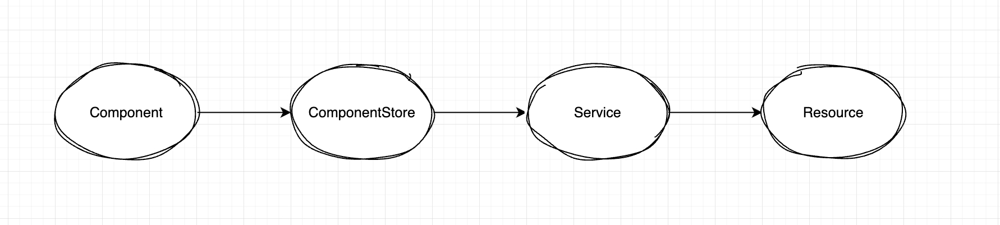

# JobBoard

## Installation

run `npm install`
No additional setup should be needed.

## Run locally

Run `npm start`.
This will start json-server with provided db.json and start angular dev server. Navigate to `http://localhost:4200/` for application and `http://localhost:3000` for api

## Running tests

Run `npm run tests`

Running tests with coverage `ng test --code-coverage`

## Dependencies
* Tailwind
* @ngrx/component-store
* Json-server

## Architecture overview

* Presentational and Container components
* Component store
* Service - Transforms DTOs to ViewModels and vice versa
* Resources - Send http request towards backend

Please note, that Resources are modeled on .net approach of Resources where we can plug and play different resources, my understanding of resource pattern in angular is that in this case we could now create a resource towards real API server and just replace the current Json-server one
